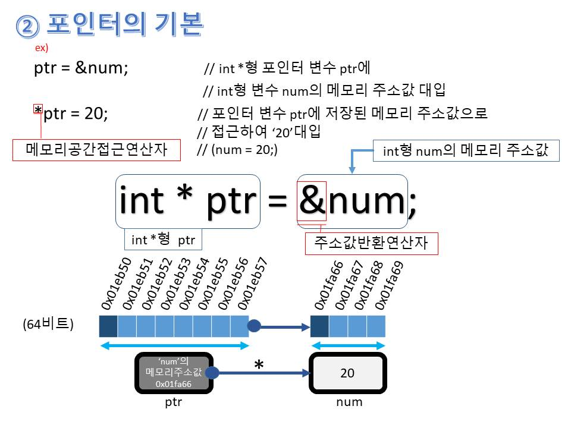
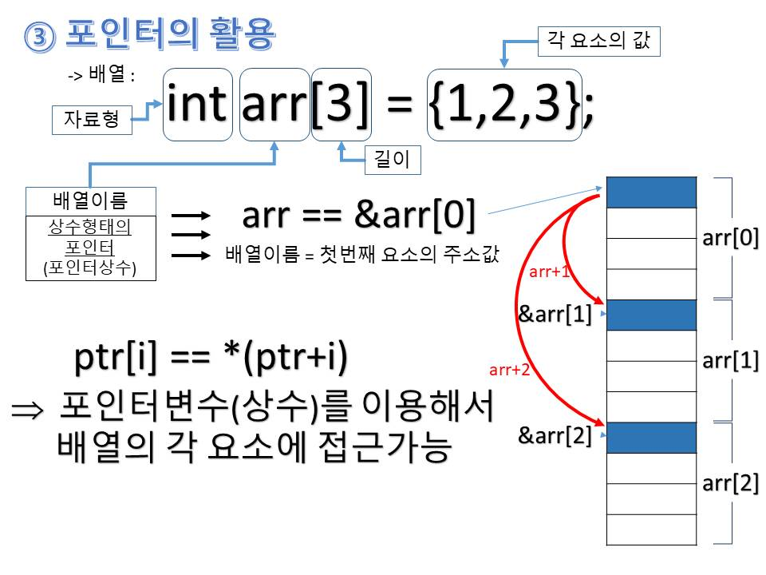
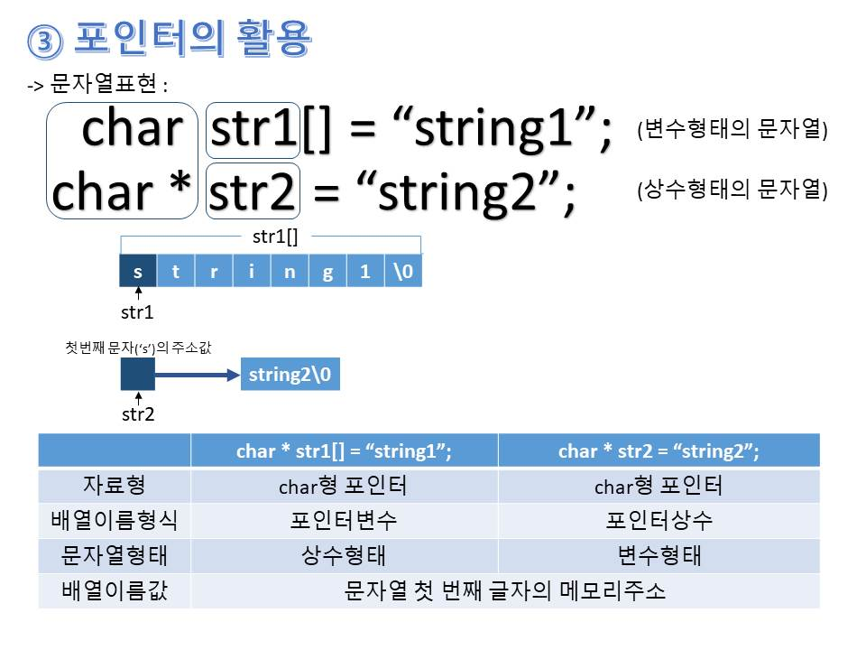
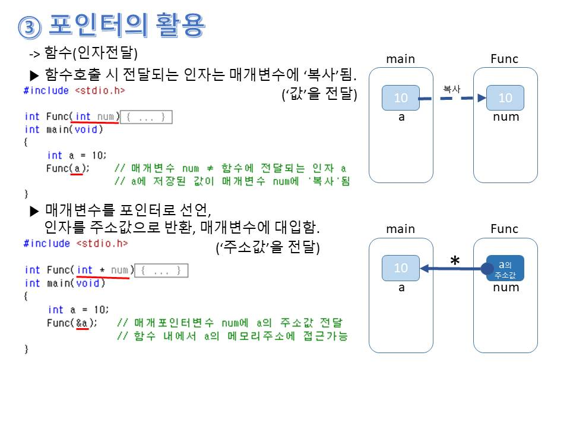
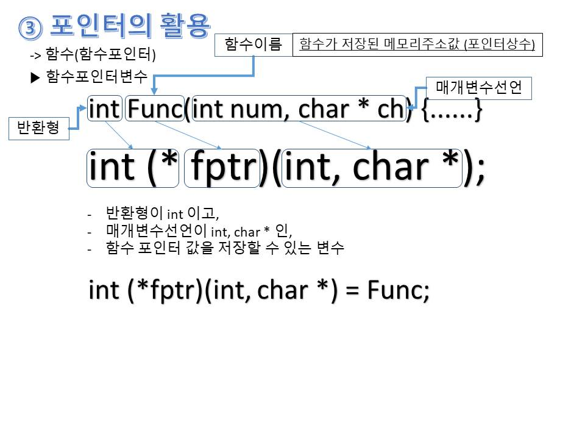
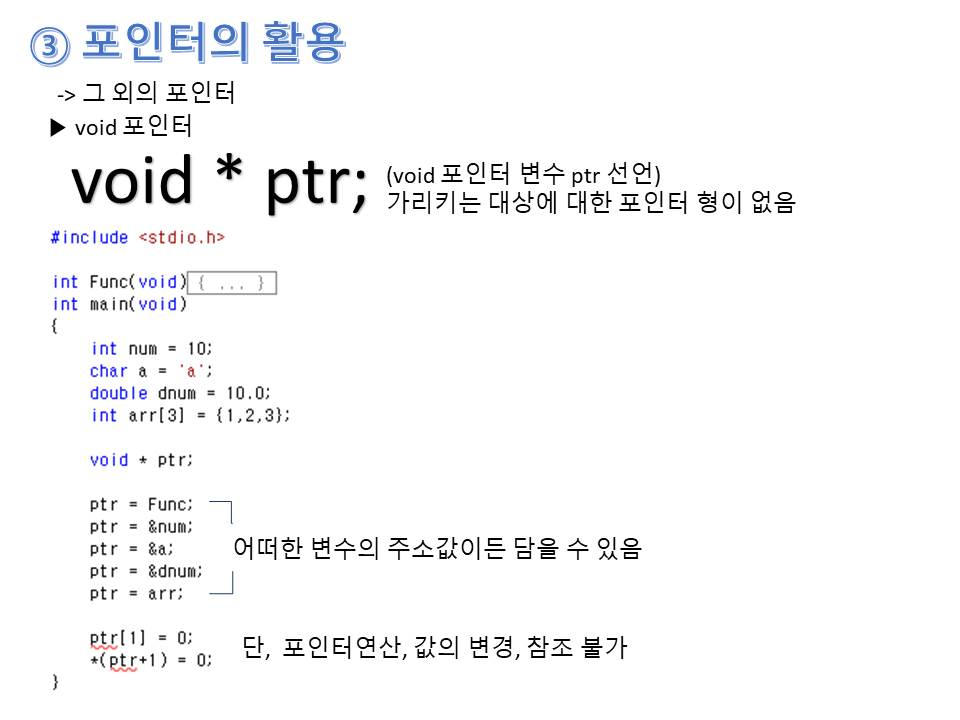
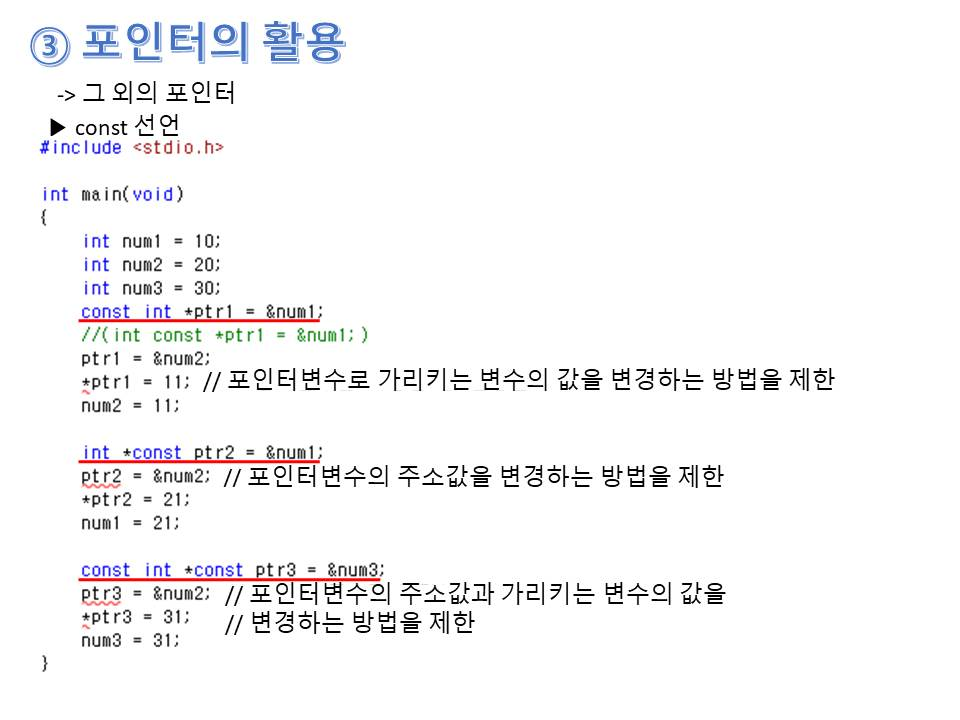

임베디드 제어 관점에서의 C언어 문법 정리
=============
이번 포스팅은 제가 지금까지 임베디드 펌웨어를 다루면서 C언어 문법 중 사소하지만 중요하다고 생각하는 내용을 정리하려합니다.

포스팅을 통해 정리하면서 막상 쓰지만 잘 인지하고 있지 못하거나 그냥 쓰는 것들 알고보니 햇갈리고 있었던 부분들을 알게된 계기가 되었습니다.

C언어의 기본부터 심화까지 다루어볼 것이고 저의 주관적인 관점이 많이 들어가 있음을 먼저 말씀드립니다.

# 1. C언어 기본
## 1.1 연산자
### 1.1.1 대입연산자 ( = )
* 연산자 **오른쪽** 에 있는 값을 연산자 **왼쪽** 에 있는 변수에 대입한다. **( <-- )**
```
오른쪽, 왼쪽을 햇갈리지 말기
나머지 연산자는 왼쪽에서 오른쪽으로 처리
```

### 1.1.2 증감연산자 ( ++ , -- )
* ++num : 전위증가. 선 증가 후 연산
* num++ : 후위증가. 선 연산 후 증가
* --num : 전위감소, 선 감소 후 연산
* num-- : 후위감소, 선 연산 후 감소
```
전위증가(감소)는 먼저 변수값을 증가(감소) 후 연산(함수 매개변수 대입 등) 수행.
후위증가(감소)는 먼저 연산(함수 매개변수 대입 등) 후 변수값을 증가(감소) 수행.
소괄호 '(' ')' 의 영향을 받지 않음!
```

### 1.1.3 관계연산자 ( < , > , == , != , <= , >= )와 논리 연산자( && , || , ! )
```
관계연산자가 논리연산자보다 먼저 수행함!
0이 아닌 모든 값은 참(ture)
```

### 1.1.4 비트연산자 ( & , | , ^ , ~ , << , >> )
```
비트연산에 사용되는 변수는 변화 없음. 결과만 반환함.
```
* ^ : 비트단위 XOR. 두 개의 비트가 서로 다른 경우에 1을 반환.
* num<<2 : num을 2 칸 왼쪽(<<) 이동 결과 반환
* num>>2 : num을 2 칸 오른쪽(>>) 이동 결과 반환
```
햇갈리지 말것.
```

### 1.1.5 조건연산자
* (조건식) ? (true_data) : (false_data)

### 1.1.6 연산자의 우선순위와 결합방향
```
결합방향? 
=> 우선순위가 동일한 두 연산자가 하나의 수식에 존재하는 경우, 
   어떠한 순서( <-- or --> )대로 연산하는지를 결정한 것
```
* 연산자의 우선순위와 결합방향 표


## 1.2 데이터 표현 방식
### 1.2.1 2진수, 8진수, 16진수 데이터 표현
* int num1 = 15;  //10진수의 표현
* int num2 = 0b00001111;  //0b로 시작하면 2진수로 인식
* int num3 = 0x0F;  //0x로 시작하면 16진수로 인식
* int num4 = 017;  //0으로 시작하면 8진수로 인식
```
솔직히 8진수는 쓸일이 없을 거 같다
```

### 1.2.2 정수의 부호 표현방식
* (MSB) 0 0 0 0 0 1 0 1 (LSB) //+5
* (MSB) 1 1 1 1 1 0 1 1 (LSB) //-5
```
가장 최상위 비트(MSB)의 값이 0 이면 양수, 1 이면 음수
하지만, 음의 정수를 표현할 때는 2의 보수를 취함.
음의 정수를 비트 연산 시, 참고할 것.
```

### 1.2.3 실수의 오차
* 0.1을 100번 더한 결과 : 10.000002
```
실수에 대한 연산 시, 실수 자체가 가지고 있는 '부동 소수점 오차'로 인한 
출력결과의 오차 발생.
=> 절대로! 실수와 정수의 비교 연산 시,
   1. 실수를 정수로 Casting 한 후 비교 연산
      (소수점자리까지 비교하고 싶을 경우, 해당 소수점자리만큼 10을 곱한 후 정수로 Casting 해서 비교할 것.)
   2. 실수와 비교하려는 수의 차이를 구하고 math.h 헤드파일의 fabsf 함수를 사용하여 절댓값으로 만들고
      머신 엡실론(machine epsilon)과 비교하는 방법을 사용할 것.
```

## 1.3 자료형
### 1.3.1 자료형 종류와 데이터의 표현 범위
* char : 1바이트
* short : 2바이트
* int : 2바이트
* long : 4바이트
* long long : 8바이트
* float : 4바이트
* double : 8바이트
* long double : 8바이트 이상
```
사용하는 컴파일러에 따라 미세하게 다른 점이 있는 것으로 알고 있다.
(C언어의 표준을 정하는 ANSI에서 자료형 별 크기를 정확히 제한하고 있지 않다.)
특히, short와 int는 최소 2바이트이되, int는 short와 크기가 같거나 더 커야한다.
```

### 1.3.2 Sizeof 연산자
* int sz1 = sizeof(int); // 자료형 int의 크기를 Byte 단위로 반환.
```
메모리 공간에서 실제로 소모하는 메모리의 크기를 바이트 단위로 반환해준다.
자신이 사용하는 컴파일러의 자료형 별 바이트 크기를 확인할 수 있다.
절대로 함수가 아니다. 연산자이다.
```

### 1.3.3 접미사를 이용한 상수 표현
* U : unsigned int ( ex : 1250U )
* L : long
* UL : unsigned long ( ex : 1250UL )
* LL : long long
* ULL : unsigned long long
* F : float ( ex : 5.42F)
```
특정 자료형을 기반으로 상수를 표현
특히 임베디드 쪽에서의 연산은 해주는것이 좋았다.
상수의 이름은 꼭 모두 대문자로 표현할 것.
```

### 1.3.3 접미사를 이용한 상수 표현
* const double PI=3.1415; // PI라는 변수는 상수. 값의 변경 불가함.
```
값이 변하면 안되는 경우(ex : 레지스터 어드레스 값 등)에 꼭 써줄 것.
```

## 1.4 함수
### 1.4.1 지역 변수(Local Variable)(Automatic Variable)
* 지역변수는 중괄호{} 내에 선언되는 변수이다
```
각기 다른 중괄호에 같은 이름의 지역변수를 선언 시, 실제로는 다른 변수로 선언 된다.
(각 지역변수의 메모리 어드레스가 다르다.)
소스 분석 시, 다른 중괄호의 같은 이름의 지역변수는 서로 같다고 생각하지 말 것.
(더더욱 지역변수이름을 저런 방법으로 표현한다면 안 됨)
```
* 전역변수와 동일한 이름의 지역변수 선언 시
```
해당 중괄호{}지역 내에서는 전역변수가 가리워지고, 지역변수로의 접근이 이루어짐.
소스 분석 시, 전역변수와 같은 이름의 지역변수는 서로 같다고 생각하지 말 것.
(더더욱 전역변수와 지역변수이름을 저런 방법으로 표현한다면 안 됨)
```

### 1.4.1 static 변수
* static 지역 변수
```
- 선언된 함수(중괄호) 내에서만 접근이 가능함. (지역변수 특성)
- 딱 1회 초기화되고 프로세서 종료 시까지 메모리 공간에 존재함. (전역변수 특성)
- 이 변수가 접근하는 영역이 하나의 함수로 제한해야할 시 적극적으로 사용 할 것.
```
* static 전역 변수

## 1.5 배열
### 1.5.1 배열 표현
* type arr[x] = {...};

### 1.5.2 문자 배열 vs 문자열
* 맨 마지막에 NULL문자가 있음 : 문자열
* 맨 마지막에 NULL문자가 없음 : 문자 배열

## 1.6 포인터
### 1.6.1 포인터 기본



```
- 포인터 변수의 크기
  32bit Processor 일 경우 : 4Byte
  64bit Processor 일 경우 : 8Byte
```

### 1.6.2 포인터와 배열



### 1.6.3 포인터와 문자열 표현



### 1.6.4 포인터와 함수
* Call by value vs Call by reference

```
- 매우매우 중요함
```

### 1.6.5 함수포인터



### 1.6.6 void 포인터



* void 포인터에 함수 주소를 넣는 경우,

### 1.6.7 const 선언 포인터



# 2. C언어 깊은 이해
## 2.1 문자열 관련 함수(string.h)
### 2.1.1 strlen
* #include <string.h>
* size_t strlen(const char * s);
```
전달된 문자열의 길이 반환. 단, NULL 문자는 포함 X
```

### 2.1.2 strcpy, strncpy
* #include <string.h>
* char * strcpy(char * dest, const char * src);
```
src 문자열을 dest에 복사.
복사된 문자열의 주소값 반환.
```
* char * strncpy(char * dest, const char * src, size_t n);
```
src 문자열을 dest에 복사하되, n 값에 해당하는 문자 수만 큼 복사.
복사된 문자열의 주소값 반환.
```

### 2.1.3 strcat, strncat
* #include <string.h>
* char * strcpy(char * dest, const char * src);
```
dest 문자열 뒤에 src 문자열을 덧붙임.
덧붙임의 시작은 NULL 문자가 저장된 위치에서부터임
덧붙여진 문자열의 주소값 반환.
```
* char * strncpy(char * dest, const char * src, size_t n);
```
dest 문자열 뒤에 src 문자열을 덧붙이되, n 값에 해당하는 문자 수만 큼 복사.
덧붙임의 시작은 NULL 문자가 저장된 위치에서부터임
덧붙여진 문자열의 주소값 반환.
```

### 2.1.4 strcmp, strncmp
* #include <string.h>
* int strcmp(const char * s1, const char * s2);
```
s1 문자열과 s2 문자열을 비교
같으면 0, 같지 않으면 0이 아닌 값 반환.
```
* int strncmp(const char * s1, const char * s2, size_t n);
```
s1 문자열과 s2 문자열을 n 만큼의 문자만 비교
(ASCII 코드값이) s1이 더 크면 0보다 큰 값, s2가 더 크면 0보다 작은 값, s1 과 s2의 내용이 같으면 0 반환.
```

## 2.2 문자열 변환 함수(stdlib.h)
### 2.2.1 atoi
* #include <stdlib.h>
* int atoi(const char * str);
```
str 문자열의 내용을 int형으로 반환
```
### 2.2.2 atol
* #include <stdlib.h>
* long atol(const char * str);
```
str 문자열의 내용을 long형으로 반환
```
### 2.2.3 atof
* #include <stdlib.h>
* double atof(const char * str);
```
str 문자열의 내용을 double형으로 반환
```

## 2.3 구조체(struct)
### 2.3.1 구조체 기본

```
구조체 간 대입연산만 가능
(대입연산을 제외한 다른 연산들은 구조체 변수를 대상으로 따로따로(관련함수 구현) 할 것.)
```
### 2.3.2 구조체 포인터 변수
* 기본
* 구조체의 멤버에 구조체 포인터 변수 선언

```
구조체 변수의 주소값 = 구조체의 첫 번째 멤버의 주소값
```


## 2.4 typedef
* 기본

```
가장 마지막에 등장하는(가장 오른쪽에 있는) 단어를 중심으로 새로운 이름이 됨.
```

## 2.5 공용체(union)
### 2.5.1 공용체 기본

## 2.6 열거형(enum)
### 2.6.1 열거형 기본

## 2.7 파일 스트림(stream), 파일 입출력
### 2.7.1 fopen
* #include <stdio.h>
* FILE * fopen(const char * filename, const char * mode);
```
성공 시 해당 파일의 FILE 구조체 변수 주소 값 반환, 실패 시 NULL 포인터 반환
```

### 2.7.2 fputc
* #include <stdio.h>
* int fputc(int c, FILE * pFile);
```
성공 시 0, 실패 시 EOF(-1)
```

### 2.7.3 fgetc
* #include <stdio.h>
* int fgetc(FILE * pFile);
```
문자를 하나가 반환됨. (여러 문자가 있을 시, 여러 번 호출해서 읽어야함)
성공 시 0, 실패 시 EOF(-1)
또한 성공 시, 파일 위치 지시자가 다음 문자를 가리키게 됨.
```

### 2.7.4 feof
* #include <stdio.h>
* int feof(FILE * pFile);
```
파일의 끝에 도달한 경우 0이 아닌 값 반환
```

### 2.7.5 fread(바이너리 데이터 입력)
* #include <stdio.h>
* size_t fread(void  * buffer, size_t size, size_t count, FILE * stream);
```
size 크기의 데이터 count개를 stream으로부터 읽어 들여서 buffer에 저장
성공 시 전달인자 count, 실패 또는 파일의 끝 도달 시 count보다 작은 값 반환
count보다 작은 값 반환 시, feof를 이용하여 실패 또는 파일의 끝에 도달했는지 확인해야함.
```
### 2.7.6 fwrite(바이너리 데이터 출력)
* #include <stdio.h>
* size_t fwrite(void  * buffer, size_t size, size_t count, FILE * stream);
```
size 크기의 데이터 count개를 buf으로부터 읽어 들여서 fp에 저장
성공 시 전달인자 count, 실패 시 count보다 작은 값 반환
```

### 2.7.7 fflush
* #include <stdio.h>
* int fflush(FILE * pFile);
```
성공 시 0, 실패 시 EOF(-1)
```

### 2.7.8 fclose
* #include <stdio.h>
* int fclose(FILE * pFile);
```
성공 시 0, 실패 시 EOF(-1)
```

### 2.7.9 fprintf(파일데이터 출력)
* #include <stdio.h>
* int fprintf(FILE * pFile, "...", ...);

### 2.7.10 fscanf(파일데이터 읽기)
* #include <stdio.h>
* int fscanf(FILE * pFile, "...", ...);

### 2.7.11 fseek(파일 위치 지시자 이동)
* #include <stdio.h>
* int fseek(FILE * stream, long offset, int wherefrom);
```
stream으로 전달된 파일 위치 지시자를 wherefrom에서부터 offset 바이트 만큼 이동
- wherefrom
  SEEK_SET : 파일 맨 앞에서부터 이동 시작 (0)
  SEEK_CUR : 현재 위치에서부터 이동 시작 (1)
  SEEK_END : 파일 맨 끝에서부터 이동 시작 (2)
```

### 2.7.12 fseek(파일 위치 지시자 위치 찾기)
* #include <stdio.h>
* int ftell(FILE * stream);
```
stream의 파일 위치 지시자가 가리키는 바이트 위치를 반환
0 부터 시작(첫번째 바이트)
```

## 2.8 운영체제 환경에 따른 개행
* MS-DOS(Windows) : \r\n
* Mac(Mackintosh) : \r
* Unix계열(Linux) : \n


## 2.9 메모리 구조 및 메모리 동적 할당
### 2.9.1 메모리 구성(단일 스레드)
ㅡㅡㅡㅡㅡ
  code
ㅡㅡㅡㅡㅡ
  data
ㅡㅡㅡㅡㅡ
  heap
ㅡㅡㅡㅡㅡ
  stack
ㅡㅡㅡㅡㅡ
```
code : 실행할 프로그램의 코드가 저장되는 공간
data : 전역변수, static 지역변수. 프로세스 종료시까지 남아있게 됨
heap : 원하는 시점에 원하는 영역만큼 할당~소멸을 할 수 있는 영역
stack : 지역변수, 매개변수.(RTOS에서는 ~~~) 해당 함수를 빠져나가면 소멸
```

### 2.9.2 malloc, free
* #include <stdlib.h>
* void * malloc(size_t size);
```
heap 영역으로 size 만큼 메모리 공간 할당(단, 할당 영역을 별도 값으로 초기화하지 않음)
성공 시, 할당된 메모리 주소 값, 실패시 NULL 반환
```
* void free(void * ptr);
```
heap 영역에 할당된 메모리 공간 해제
```
```
사용예시 : 함수가 호출될 때마다 문자열 저장을 위한 메모리 공간의 할당이 가능해야하고
           이 메모리 공간은 함수를 빠져나가도 소멸되지 않고 존재해야하는 경우
```
* void * calloc(size_t elt_count, size_t elt_size);
```
heap 영역으로 elt_size 크기의 블록을 elt_count 만큼 할당(단, 할당 영역을 별도 값으로 초기화)
성공 시, 할당된 메모리 주소 값, 실패시 NULL 반환
```
* void * realloc(void * ptr, size_t size);
```
heap 영역의 ptr 영역을 size 크기로 조정.
성공 시, 새로 할당된 메모리 주소 값, 실패시 NULL 반환
만약,
    malloc 으로 반환한 주소 == realloc 으로 반환한 주소 : 뒤를 이어서 확장할 영역이 넉넉한 경우
    malloc 으로 반환한 주소 != realloc 으로 반환한 주소 : 뒤를 이어서 확장할 영역이 넉넉하지 않음
                                                         (힙의 다른 위치에 별도로 할당)
```

## 2.10 매크로, 선행처리기
### 2.10.1 매크로 상수
* #define AAA value
```
매크로 상수 AAA를 value로 전부 치환
```
### 2.10.2 매크로 함수
* #define FUNC(X) ((X)+(X))
```
매크로 함수 FUNC(X)를 ((X)+(X))로 전부 치환
매크로 함수 내용 작성 시, 항상 소괄호()로 묶어 줄 것.
```
### 2.10.3 매크로 개행
* \ 를 사용함

### 2.10.4 조건부 컴파일
* #if...#endif
```
#if 문 뒤에 내용이 참(true)이면 #endif 까지의 내용이 삽입
                   거짓(false)이면 내용이 삭제
중간에 #elif를 넣어서 사용 가능
```
* #ifdef...#endif
```
#if 문 뒤의 매크로가 정의되어 있으면 #endif 까지의 내용이 삽입
                     정의되어 있지않으면 내용이 삭제
```
* #ifndef...#endif
```
#if 문 뒤의 매크로가 정의되어 있지않으면 #endif 까지의 내용이 삽입
                     정의되어 있으면 내용이 삭제
```
* 모두 중간에 #else를 넣어서 사용 가능

### 2.10.5 필요한 형태대로 단순하게 결합하기
* #define CON(AB,CD) AB ## CD
* ABCD

